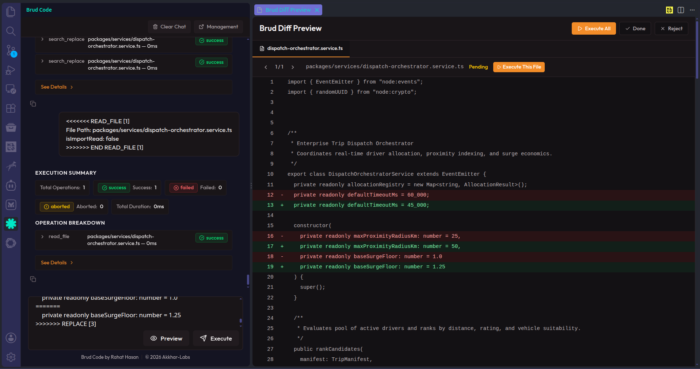

<p align="center">
  
</p>

<h3 align="center">AI-Assisted Coding Platform — Manual Paste, Surgical Apply, Full Control</h3>

<p align="center">
  
  
  
  
</p>

<p align="center">
  <strong>Fork of <a href="https://github.com/akkhar-labs/akkhar-code-patcher">Akkhar Code Patcher</a></strong> — the original project is unmaintained; Brud Code is its official continuation under a new identity.
</p>

<p align="center">
  
</p>

---

## Overview

Brud Code is a **free, open-source VS Code extension** for applying AI-generated code changes with full manual control. It works with any AI chatbot — ChatGPT, Claude, Gemini, or others — with no API keys and no subscription required.

Rather than letting an AI model edit files invisibly, Brud Code keeps you in the loop: you paste the AI's output into the sidebar, preview the diff, and decide whether to apply it. Every change is logged and reversible, and your full session history is stored locally in your workspace.

## Table of Contents

- [Why Brud Code](#why-brud-code)
- [Installation](#installation)
- [How It Works](#how-it-works)
- [Features](#features)
- [Benchmarks](#benchmarks)
- [History & Revert](#history--revert)
- [Prompt Library](#prompt-library)
- [Documentation](#documentation)
- [Contributing](#contributing)
- [FAQ](#faq)
- [License](#license)

## Why Brud Code

- **No API keys or subscriptions** — paste output from any AI chatbot, free or paid.
- **Review before you apply** — every change is previewed as a diff, never applied silently.
- **Bulk-safe** — a single Brud block can create, patch, or modify large numbers of files in one pass.
- **Fully reversible** — every session can be reverted or restored with one click.
- **No forced dependencies** — works with or without Git; no account, server, or third-party service required.

## Installation

Download the [latest VSIX release](https://github.com/rahatarch/brud/releases) and install it manually:

```bash
code --install-extension brud-code-*.vsix
```

Or, once published to the marketplace:

```bash
code --install-extension rahatarch.brud-code
```

Alternatively, from within VS Code:

1. Open the Extensions view (`Ctrl+Shift+X`).
2. Search for **Brud Code** and click **Install**.
3. Or use the `...` menu → **Install from VSIX** and select the downloaded file.
4. Reload VS Code when prompted.

## How It Works

1. Install Brud Code and open the **Prompt Library** in the sidebar.
2. Copy the **Master System Prompt** into ChatGPT, Claude, Gemini, or any other chatbot.
3. Ask the AI for a code change, e.g. *"Add a discount parameter to `calculateTotal`."*
4. The AI responds with a Brud block:

   ```txt
   File Path: src/utils.js
   <<<<<<< SEARCH [1]
   function calculateTotal(price, tax) {
     return price + tax;
   }
   =======
   function calculateTotal(price, tax, discount = 0) {
     return price + tax - discount;
   }
   >>>>>>> REPLACE [1]
   ```

5. Paste the block into the Brud Code sidebar, preview the diff, and execute.
6. Click **Copy All** to copy the result (status, file paths, messages, per-file details) back into your clipboard, ready to paste back to the AI — closing the loop with no manual reformatting.

## Features

**File Operations**
Create, delete, rename, move, copy, and append files and directories through AI-generated Brud blocks. Every operation is previewed, logged, and reversible.

**Bulk Operations**
Apply the same transformation across many files or an entire directory tree in a single atomic operation, without requiring the AI to iterate file by file.

**Code Discovery**
Extract your project structure as a token-efficient JSON tree, query codebase metadata, and search or read files with import-chain following — giving your AI relevant context without bloating the prompt.

**Terminal Integration**
Run single commands, sequential chains, parallel groups, or conditional pipelines from AI-generated blocks. Interactive CLI programs are supported, with output fed back to the AI for dynamic workflows.

**AI-Agnostic**
Works with any AI chatbot capable of producing text output — free or paid, via web UI or API. Use `GET_TOOL_INFO` mid-conversation to let the AI discover available tools dynamically.

## Benchmarks

*Metrics below are from testing on a real 384K LOC production codebase. Manual verification confirmed 100% accuracy across all benchmarks.*

| Benchmark | Scale | Details | Manual Actions | Brud Actions | Time |
|---|---|---|---|---|---|
| Create Files | 100 files | Each file with unique content | ~400 | 2 | Milliseconds |
| Create Files | 1,000 files | Each file with unique content, all manually verified | ~4,000 | 2 | Under 1 second |
| Search & Replace | 467 files, 384K LOC | 467 patched, 0 skipped, 0 failed | ~2,802 | 2 | Milliseconds |
| Append Multi | 467 files | 467 modified, 0 failed | ~1,868 | 2 | Milliseconds |
| Revert Session | 1,000 files | All changes undone, files removed | ~3,000 | 1 | Milliseconds |
| Restore Session | 1,000 files | All files recovered to post-state | ~3,000 | 1 | Milliseconds |

**Verified results:**
- 1,000/1,000 files created with unique contents — manually verified
- 467/467 files patched — zero skipped, zero failed
- 467/467 files appended — zero failed
- 1,000/1,000 files reverted with one click — manually verified
- 1,000/1,000 files restored with one click — manually verified
- 100% success rate across all benchmarks

## History & Revert

Brud Code includes a built-in history and revert system — no Git, GitHub, or third-party service required.

- **Hybrid snapshot engine** — pre-snapshots store full file contents; post-snapshots store unified diffs, minimizing storage overhead while enabling instant revert to either state.
- **Session-level revert and restore** — revert an entire session or individual operations, and undo a revert just as easily.
- **7-day trash protection** — deleted sessions are soft-deleted with a 7-day recovery window before permanent cleanup.
- **Automatic retention** — sessions older than 3 months are automatically soft-deleted; restoring a session resets its retention clock.
- **Local-only storage** — history is stored as JSON in `.brud/history/` at the workspace root, auto-added to `.gitignore` and excluded from VS Code search and file watching.
- **Built-in diff engine** — unified diffs are computed internally, with no external diff tool dependency.

## Prompt Library

The Prompt Library ships with ready-made prompts covering file operations, search, terminal commands, and more. Copy the **Master System Prompt** into any chatbot to teach it the Brud block format, and use `GET_TOOL_INFO` to expose additional tools mid-conversation.

## Documentation

- [ARCHITECTURE.md](ARCHITECTURE.md) — technical deep dive into the codebase
- [CONTRIBUTING.md](CONTRIBUTING.md) — contribution guidelines
- [Prompt Library](https://github.com/rahatarch/brud) — bundled with the extension

## Contributing

Contributions are welcome — see [CONTRIBUTING.md](CONTRIBUTING.md) for setup instructions, coding conventions, and how to submit a pull request.

## FAQ

<details>
<summary><strong>Where did Brud Code come from?</strong></summary>
<br>
Brud Code is a fork of <a href="https://github.com/akkhar-labs/akkhar-code-patcher">Akkhar Code Patcher</a>. The original project is no longer maintained, and Brud Code continues its development under a new identity.
</details>

<details>
<summary><strong>Does Brud Code require API keys?</strong></summary>
<br>
No. Brud Code works with any AI chatbot, including free web-based versions. You paste the AI's output directly — no API keys, tokens, or subscriptions required.
</details>

<details>
<summary><strong>Is Brud Code free?</strong></summary>
<br>
Yes. Brud Code is free and open source under the MIT license.
</details>

<details>
<summary><strong>Which AI chatbots work with Brud Code?</strong></summary>
<br>
Any chatbot that can output text — including ChatGPT, Claude, Gemini, DeepSeek, Grok, and Llama. The Master System Prompt teaches the Brud block format to any model.
</details>

## License

Licensed under the [MIT License](LICENSE).

---

<p align="center">
  <a href="https://github.com/rahatarch/brud">⭐ Star on GitHub</a> ·
  <a href="https://github.com/rahatarch/brud/issues">🐛 Report a Bug</a> ·
  <a href="https://github.com/rahatarch">🐦 Follow @rahatarch</a>
</p>